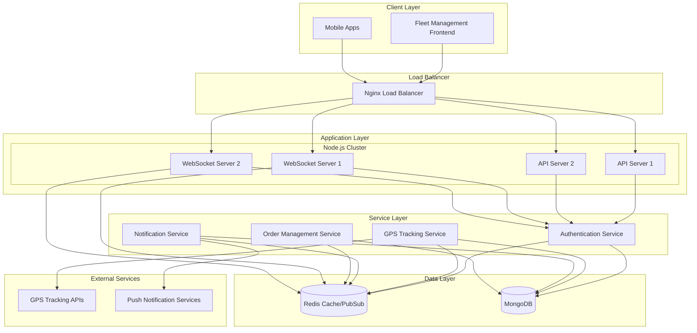
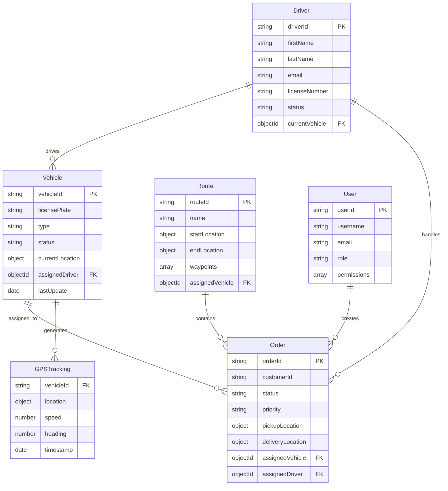

# Technical Design Document: Real-Time Backend Implementation

## Overview

This document provides the comprehensive technical architecture and implementation design for transforming the existing frontend-only Fleet Management System into a real-time application. The solution implements a Node.js + Express.js + Socket.io + MongoDB + Redis backend architecture that provides WebSocket-based real-time communication, persistent data storage, JWT authentication, and scalable performance.

### System Architecture Summary

The real-time backend follows a layered architecture pattern with clear separation of concerns:

- **Presentation Layer**: Existing HTML/CSS/JavaScript frontend with Socket.io client integration
- **API Gateway Layer**: Express.js REST endpoints with JWT authentication middleware
- **WebSocket Layer**: Socket.io server for real-time bidirectional communication
- **Business Logic Layer**: Core fleet management services and real-time processors
- **Data Access Layer**: MongoDB with Mongoose ODM for data persistence
- **Caching Layer**: Redis for session storage, caching, and pub/sub messaging
- **External Integration Layer**: GPS tracking APIs and notification services

### Key Technical Decisions

1. **Database Choice**: MongoDB selected for flexible schema design and excellent geospatial query support
2. **WebSocket Implementation**: Socket.io chosen for robust real-time communication with fallback mechanisms
3. **Authentication Strategy**: JWT tokens with Redis-based session management
4. **Caching Strategy**: Redis for high-performance caching and real-time message distribution
5. **API Design**: RESTful endpoints with consistent naming conventions and proper HTTP semantics

## Architecture

### System Architecture Diagram



### Component Architecture

#### 1. API Gateway Layer
- **Express.js Router**: Handles HTTP requests with middleware pipeline
- **Authentication Middleware**: JWT token validation and user context injection
- **Rate Limiting Middleware**: Prevents API abuse with configurable limits
- **Validation Middleware**: Request parameter and body validation
- **Error Handling Middleware**: Centralized error processing and logging

#### 2. WebSocket Communication Layer
- **Socket.io Server**: Manages real-time bidirectional communication
- **Connection Manager**: Handles client connections, authentication, and room management
- **Event Router**: Routes WebSocket events to appropriate handlers
- **Broadcast Manager**: Distributes real-time updates to connected clients

#### 3. Business Logic Services
- **Vehicle Service**: Manages vehicle CRUD operations and status tracking
- **Driver Service**: Handles driver management and assignment logic
- **Order Service**: Processes order lifecycle and status updates
- **Route Service**: Manages route planning and optimization
- **GPS Service**: Processes real-time location data and tracking

#### 4. Data Access Layer
- **MongoDB Connection Manager**: Handles database connections and pooling
- **Mongoose Models**: Defines data schemas and validation rules
- **Repository Pattern**: Abstracts database operations with consistent interfaces
- **Migration Manager**: Handles database schema changes and data migrations

## Components and Interfaces

### Core Components

#### 1. Express.js API Server

```javascript
// Server Configuration
const server = {
  port: process.env.PORT || 3000,
  cors: {
    origin: process.env.FRONTEND_URL,
    credentials: true
  },
  middleware: [
    'cors',
    'helmet',
    'compression',
    'morgan',
    'express.json',
    'express.urlencoded'
  ]
}
```

**Key Interfaces:**
- REST API endpoints following OpenAPI 3.0 specification
- Middleware pipeline for request processing
- Error handling with standardized response format
- Health check endpoints for monitoring

#### 2. Socket.io WebSocket Server

```javascript
// WebSocket Configuration
const socketConfig = {
  cors: {
    origin: process.env.FRONTEND_URL,
    methods: ["GET", "POST"]
  },
  transports: ['websocket', 'polling'],
  pingTimeout: 60000,
  pingInterval: 25000
}
```

**Event Interface:**
- Connection events: `connect`, `disconnect`, `reconnect`
- GPS events: `gps:update`, `gps:history`, `vehicle:location`
- Order events: `order:created`, `order:updated`, `order:status`
- Notification events: `notification:new`, `alert:emergency`

#### 3. MongoDB Database Schema

**Vehicle Collection:**
```javascript
const vehicleSchema = {
  vehicleId: String,
  licensePlate: String,
  type: String,
  status: String,
  currentLocation: {
    type: { type: String, default: 'Point' },
    coordinates: [Number] // [longitude, latitude]
  },
  assignedDriver: ObjectId,
  lastUpdate: Date,
  specifications: Object
}
```

**Order Collection:**
```javascript
const orderSchema = {
  orderId: String,
  customerId: String,
  status: String,
  priority: String,
  pickupLocation: Object,
  deliveryLocation: Object,
  assignedVehicle: ObjectId,
  createdAt: Date,
  updatedAt: Date,
  statusHistory: [Object]
}
```

#### 4. Redis Caching Strategy

**Cache Keys:**
- `vehicle:location:{vehicleId}` - Current vehicle locations
- `order:active:{orderId}` - Active order data
- `user:session:{userId}` - User session data
- `kpi:dashboard` - Dashboard metrics cache

**Pub/Sub Channels:**
- `gps:updates` - GPS location broadcasts
- `order:status` - Order status changes
- `notifications` - Push notifications
- `alerts:emergency` - Emergency alerts

### Interface Specifications

#### REST API Endpoints

**Authentication Endpoints:**
```
POST /api/auth/login
POST /api/auth/logout
POST /api/auth/refresh
GET  /api/auth/profile
```

**Vehicle Management:**
```
GET    /api/vehicles
POST   /api/vehicles
GET    /api/vehicles/:id
PUT    /api/vehicles/:id
DELETE /api/vehicles/:id
GET    /api/vehicles/:id/location
GET    /api/vehicles/:id/history
```

**Order Management:**
```
GET    /api/orders
POST   /api/orders
GET    /api/orders/:id
PUT    /api/orders/:id
DELETE /api/orders/:id
PUT    /api/orders/:id/status
GET    /api/orders/:id/history
```

**Real-Time Endpoints:**
```
GET /api/dashboard/kpis
GET /api/tracking/live
GET /api/notifications
```

#### WebSocket Event Specifications

**Client to Server Events:**
```javascript
// Authentication
socket.emit('authenticate', { token: 'jwt_token' })

// GPS Updates (from vehicle devices)
socket.emit('gps:update', {
  vehicleId: 'V001',
  coordinates: [-74.006, 40.7128],
  timestamp: Date.now(),
  speed: 45,
  heading: 180
})

// Order Status Updates
socket.emit('order:status:update', {
  orderId: 'ORD001',
  status: 'in_transit',
  timestamp: Date.now(),
  userId: 'user123'
})
```

**Server to Client Events:**
```javascript
// Real-time GPS Updates
socket.emit('vehicle:location:update', {
  vehicleId: 'V001',
  coordinates: [-74.006, 40.7128],
  speed: 45,
  timestamp: Date.now()
})

// Order Status Broadcasts
socket.emit('order:status:changed', {
  orderId: 'ORD001',
  status: 'delivered',
  timestamp: Date.now(),
  updatedBy: 'driver456'
})

// Dashboard KPI Updates
socket.emit('dashboard:kpis:update', {
  activeVehicles: 25,
  pendingOrders: 12,
  completedToday: 45,
  averageSpeed: 35.5
})

// Emergency Alerts
socket.emit('alert:emergency', {
  type: 'accident',
  vehicleId: 'V001',
  location: [-74.006, 40.7128],
  severity: 'high',
  timestamp: Date.now()
})
```

## Data Models

### MongoDB Schema Definitions

#### Vehicle Model
```javascript
const vehicleSchema = new mongoose.Schema({
  vehicleId: {
    type: String,
    required: true,
    unique: true,
    index: true
  },
  licensePlate: {
    type: String,
    required: true,
    unique: true
  },
  type: {
    type: String,
    enum: ['truck', 'van', 'car', 'motorcycle'],
    required: true
  },
  status: {
    type: String,
    enum: ['active', 'inactive', 'maintenance', 'idle'],
    default: 'active'
  },
  currentLocation: {
    type: {
      type: String,
      enum: ['Point'],
      default: 'Point'
    },
    coordinates: {
      type: [Number],
      required: true,
      index: '2dsphere'
    }
  },
  assignedDriver: {
    type: mongoose.Schema.Types.ObjectId,
    ref: 'Driver'
  },
  specifications: {
    capacity: Number,
    fuelType: String,
    year: Number,
    make: String,
    model: String
  },
  lastUpdate: {
    type: Date,
    default: Date.now
  },
  createdAt: {
    type: Date,
    default: Date.now
  }
}, {
  timestamps: true
})

// Indexes for performance
vehicleSchema.index({ vehicleId: 1 })
vehicleSchema.index({ status: 1 })
vehicleSchema.index({ 'currentLocation': '2dsphere' })
vehicleSchema.index({ assignedDriver: 1 })
```

#### Driver Model
```javascript
const driverSchema = new mongoose.Schema({
  driverId: {
    type: String,
    required: true,
    unique: true,
    index: true
  },
  firstName: {
    type: String,
    required: true
  },
  lastName: {
    type: String,
    required: true
  },
  email: {
    type: String,
    required: true,
    unique: true
  },
  phone: {
    type: String,
    required: true
  },
  licenseNumber: {
    type: String,
    required: true,
    unique: true
  },
  status: {
    type: String,
    enum: ['active', 'inactive', 'on_break', 'off_duty'],
    default: 'active'
  },
  currentVehicle: {
    type: mongoose.Schema.Types.ObjectId,
    ref: 'Vehicle'
  },
  rating: {
    type: Number,
    min: 1,
    max: 5,
    default: 5
  }
}, {
  timestamps: true
})

driverSchema.index({ driverId: 1 })
driverSchema.index({ email: 1 })
driverSchema.index({ status: 1 })
```

#### Order Model
```javascript
const orderSchema = new mongoose.Schema({
  orderId: {
    type: String,
    required: true,
    unique: true,
    index: true
  },
  customerId: {
    type: String,
    required: true,
    index: true
  },
  customerName: {
    type: String,
    required: true
  },
  status: {
    type: String,
    enum: ['pending', 'assigned', 'picked_up', 'in_transit', 'delivered', 'cancelled'],
    default: 'pending',
    index: true
  },
  priority: {
    type: String,
    enum: ['urgent', 'high', 'normal', 'low'],
    default: 'normal',
    index: true
  },
  pickupLocation: {
    address: String,
    coordinates: {
      type: [Number],
      index: '2dsphere'
    }
  },
  deliveryLocation: {
    address: String,
    coordinates: {
      type: [Number],
      index: '2dsphere'
    }
  },
  assignedVehicle: {
    type: mongoose.Schema.Types.ObjectId,
    ref: 'Vehicle'
  },
  assignedDriver: {
    type: mongoose.Schema.Types.ObjectId,
    ref: 'Driver'
  },
  estimatedDelivery: Date,
  actualDelivery: Date,
  statusHistory: [{
    status: String,
    timestamp: Date,
    updatedBy: String,
    notes: String
  }],
  items: [{
    description: String,
    quantity: Number,
    weight: Number
  }]
}, {
  timestamps: true
})

orderSchema.index({ orderId: 1 })
orderSchema.index({ customerId: 1 })
orderSchema.index({ status: 1 })
orderSchema.index({ priority: 1 })
orderSchema.index({ createdAt: -1 })
```

#### Route Model
```javascript
const routeSchema = new mongoose.Schema({
  routeId: {
    type: String,
    required: true,
    unique: true,
    index: true
  },
  name: {
    type: String,
    required: true
  },
  startLocation: {
    address: String,
    coordinates: {
      type: [Number],
      required: true
    }
  },
  endLocation: {
    address: String,
    coordinates: {
      type: [Number],
      required: true
    }
  },
  waypoints: [{
    address: String,
    coordinates: [Number],
    estimatedArrival: Date
  }],
  distance: Number, // in kilometers
  estimatedDuration: Number, // in minutes
  assignedVehicle: {
    type: mongoose.Schema.Types.ObjectId,
    ref: 'Vehicle'
  },
  orders: [{
    type: mongoose.Schema.Types.ObjectId,
    ref: 'Order'
  }],
  status: {
    type: String,
    enum: ['planned', 'active', 'completed', 'cancelled'],
    default: 'planned'
  }
}, {
  timestamps: true
})

routeSchema.index({ routeId: 1 })
routeSchema.index({ assignedVehicle: 1 })
routeSchema.index({ status: 1 })
```

#### GPS Tracking Model
```javascript
const gpsTrackingSchema = new mongoose.Schema({
  vehicleId: {
    type: String,
    required: true,
    index: true
  },
  location: {
    type: {
      type: String,
      enum: ['Point'],
      default: 'Point'
    },
    coordinates: {
      type: [Number],
      required: true,
      index: '2dsphere'
    }
  },
  speed: {
    type: Number,
    default: 0
  },
  heading: {
    type: Number,
    min: 0,
    max: 360
  },
  accuracy: Number,
  timestamp: {
    type: Date,
    required: true,
    index: true
  },
  isIdle: {
    type: Boolean,
    default: false
  }
}, {
  timestamps: true
})

// Compound indexes for efficient queries
gpsTrackingSchema.index({ vehicleId: 1, timestamp: -1 })
gpsTrackingSchema.index({ location: '2dsphere' })
gpsTrackingSchema.index({ timestamp: -1 })

// TTL index to automatically delete old GPS data after 30 days
gpsTrackingSchema.index({ timestamp: 1 }, { expireAfterSeconds: 2592000 })
```

#### User Model
```javascript
const userSchema = new mongoose.Schema({
  userId: {
    type: String,
    required: true,
    unique: true,
    index: true
  },
  username: {
    type: String,
    required: true,
    unique: true
  },
  email: {
    type: String,
    required: true,
    unique: true
  },
  passwordHash: {
    type: String,
    required: true
  },
  role: {
    type: String,
    enum: ['admin', 'manager', 'dispatcher', 'driver'],
    required: true,
    index: true
  },
  permissions: [{
    type: String,
    enum: ['read_vehicles', 'write_vehicles', 'read_orders', 'write_orders', 'read_drivers', 'write_drivers', 'admin_access']
  }],
  isActive: {
    type: Boolean,
    default: true
  },
  lastLogin: Date,
  profile: {
    firstName: String,
    lastName: String,
    phone: String,
    department: String
  }
}, {
  timestamps: true
})

userSchema.index({ userId: 1 })
userSchema.index({ username: 1 })
userSchema.index({ email: 1 })
userSchema.index({ role: 1 })
```

### Data Relationships



## Correctness Properties

*A property is a characteristic or behavior that should hold true across all valid executions of a system-essentially, a formal statement about what the system should do. Properties serve as the bridge between human-readable specifications and machine-verifiable correctness guarantees.*

### Property 1: WebSocket Connection Management

*For any* valid client with proper authentication, the WebSocket server should establish a persistent connection, emit connection status events, and maintain heartbeat monitoring at 30-second intervals.

**Validates: Requirements 1.1, 1.3, 1.6, 1.7**

### Property 2: JWT Authentication Round Trip

*For any* valid user credentials, the authentication service should generate a JWT token, validate it for subsequent requests, and properly handle token refresh before expiration.

**Validates: Requirements 1.2, 8.1, 8.2, 8.3, 8.4**

### Property 3: GPS Data Processing Pipeline

*For any* valid GPS coordinate data from vehicles, the system should validate the data, store it in the database with timestamps, calculate vehicle speed, and broadcast location updates to all connected clients.

**Validates: Requirements 2.1, 2.2, 2.3, 2.4, 2.5**

### Property 4: Vehicle Idle Detection

*For any* vehicle that remains stationary for more than 5 minutes, the GPS tracking system should automatically mark the vehicle as idle.

**Validates: Requirements 2.6**

### Property 5: Route Deviation Detection

*For any* vehicle with a planned route, when the vehicle deviates more than 1km from the route, the system should detect the deviation and trigger appropriate alerts.

**Validates: Requirements 2.7**

### Property 6: Order Status Broadcasting Pipeline

*For any* order status change, the system should persist the change to the database before broadcasting, include all required fields (order ID, status, timestamp, user), and notify all connected clients immediately.

**Validates: Requirements 3.1, 3.2, 3.3**

### Property 7: Order Status History Maintenance

*For any* order status change, the system should maintain a complete audit trail with chronological ordering, even when multiple changes occur simultaneously.

**Validates: Requirements 3.5, 3.6**

### Property 8: Dashboard KPI Broadcasting

*For any* change in fleet data (vehicle status, new orders, completed deliveries), the dashboard updater should recalculate relevant KPIs and broadcast updates to all connected clients within 30 seconds.

**Validates: Requirements 4.1, 4.2, 4.3, 4.4, 4.5**

### Property 9: Emergency Alert Broadcasting

*For any* critical emergency event (accident, breakdown, security issue), the system should broadcast alerts to all connected clients within 2 seconds of event detection.

**Validates: Requirements 5.2**

### Property 10: Notification Filtering and Delivery

*For any* notification event, the system should filter recipients based on user role and responsibility area, deliver notifications to relevant users, and store notification history for audit purposes.

**Validates: Requirements 5.1, 5.3, 5.7**

### Property 11: Database CRUD Operations

*For any* entity type (vehicles, drivers, routes, orders), the API gateway should provide complete CRUD operations with proper validation, authentication, and consistent response formats.

**Validates: Requirements 6.1, 7.1, 7.3**

### Property 12: API Response Consistency

*For any* API request, the system should return appropriate HTTP status codes, validate request parameters, and provide consistent error response formats.

**Validates: Requirements 7.2, 7.3**

### Property 13: Database Transaction Integrity

*For any* critical database operation, the system should maintain ACID compliance, support concurrent operations without data corruption, and ensure data consistency.

**Validates: Requirements 6.4, 6.5**

### Property 14: Cache Management Round Trip

*For any* frequently accessed data, the cache layer should store data in Redis, retrieve it efficiently, and invalidate cache entries when underlying data changes, with graceful fallback to database when cache is unavailable.

**Validates: Requirements 9.1, 9.2, 9.5**

### Property 15: Redis Pub/Sub Message Distribution

*For any* real-time update event, the system should use Redis pub/sub to distribute messages across multiple server instances, ensuring all instances receive the updates.

**Validates: Requirements 9.3**

### Property 16: Role-Based Access Control

*For any* authenticated user, the system should enforce role-based permissions, allowing access only to authorized resources and operations based on user role.

**Validates: Requirements 8.6**

### Property 17: Rate Limiting Enforcement

*For any* API client, the system should enforce rate limits to prevent abuse, returning appropriate error responses when limits are exceeded.

**Validates: Requirements 7.6**

### Property 18: Backward Compatibility Preservation

*For any* existing frontend functionality, the new backend should maintain compatibility with existing JavaScript functions and API calls during the transition period.

**Validates: Requirements 11.1, 11.2, 11.4**

### Property 19: Graceful Degradation

*For any* real-time feature failure, the system should continue to provide basic functionality through fallback mechanisms without complete system failure.

**Validates: Requirements 11.7**

### Property 20: Configuration Environment Management

*For any* deployment environment (development, staging, production), the system should load appropriate configuration settings and maintain environment-specific behavior.

**Validates: Requirements 12.1**

### Property 21: Health Check Monitoring

*For any* system component, health check endpoints should accurately report component status and overall system health for monitoring and load balancing purposes.

**Validates: Requirements 12.4**

### Property 22: Database Migration Consistency

*For any* database schema change or data migration, the migration scripts should execute successfully and maintain data integrity throughout the process.

**Validates: Requirements 6.2, 12.5**

### Property 23: Logging and Audit Trail

*For any* system event (authentication, data changes, errors), the system should generate appropriate log entries with configurable log levels and maintain audit trails for security events.

**Validates: Requirements 8.7, 12.3**

### Property 24: Automatic Reconnection Behavior

*For any* WebSocket connection loss, the client should automatically attempt reconnection within 5 seconds and restore the connection state.

**Validates: Requirements 1.4**

### Property 25: Maintenance Alert Scheduling

*For any* vehicle with scheduled maintenance, the notification system should send alerts exactly 24 hours in advance of the maintenance due date.

**Validates: Requirements 5.4**

## Error Handling

### Error Classification and Response Strategy

The real-time backend implements a comprehensive error handling strategy with consistent error classification, logging, and user-friendly responses.

#### Error Categories

**1. Client Errors (4xx)**
- **400 Bad Request**: Invalid request parameters, malformed JSON, missing required fields
- **401 Unauthorized**: Invalid or missing JWT tokens, expired authentication
- **403 Forbidden**: Insufficient permissions for requested operation
- **404 Not Found**: Requested resource does not exist
- **409 Conflict**: Resource conflicts (duplicate IDs, concurrent modifications)
- **422 Unprocessable Entity**: Valid request format but business logic validation failures
- **429 Too Many Requests**: Rate limiting violations

**2. Server Errors (5xx)**
- **500 Internal Server Error**: Unexpected application errors, unhandled exceptions
- **502 Bad Gateway**: External service integration failures
- **503 Service Unavailable**: Database connectivity issues, Redis unavailability
- **504 Gateway Timeout**: External API timeouts, slow database queries

#### Error Response Format

```javascript
{
  "error": {
    "code": "VEHICLE_NOT_FOUND",
    "message": "Vehicle with ID 'V001' does not exist",
    "details": {
      "vehicleId": "V001",
      "timestamp": "2024-01-15T10:30:00Z",
      "requestId": "req_123456789"
    },
    "suggestions": [
      "Verify the vehicle ID is correct",
      "Check if the vehicle has been deleted"
    ]
  }
}
```

#### WebSocket Error Handling

```javascript
// WebSocket error events
socket.emit('error', {
  type: 'AUTHENTICATION_FAILED',
  message: 'Invalid JWT token provided',
  code: 4001,
  timestamp: Date.now()
})

// Connection error handling
socket.on('connect_error', (error) => {
  console.error('Connection failed:', error.message)
  // Implement exponential backoff for reconnection
})
```

#### Database Error Handling

**Connection Failures:**
- Implement connection pooling with automatic retry logic
- Graceful degradation to read-only mode when write operations fail
- Circuit breaker pattern for external database connections

**Data Validation Errors:**
- Mongoose schema validation with custom error messages
- Pre-save hooks for complex business logic validation
- Transaction rollback for multi-document operations

**Concurrency Conflicts:**
- Optimistic locking using version fields
- Retry logic for concurrent modification conflicts
- Proper error messages for version mismatch scenarios

#### Real-Time Error Propagation

**GPS Tracking Errors:**
```javascript
// Invalid GPS coordinates
if (!isValidCoordinate(latitude, longitude)) {
  socket.emit('gps:error', {
    vehicleId: data.vehicleId,
    error: 'INVALID_COORDINATES',
    message: 'GPS coordinates are outside valid range',
    coordinates: [longitude, latitude]
  })
  return
}
```

**Order Processing Errors:**
```javascript
// Order status transition validation
if (!isValidStatusTransition(currentStatus, newStatus)) {
  socket.emit('order:error', {
    orderId: data.orderId,
    error: 'INVALID_STATUS_TRANSITION',
    message: `Cannot change status from ${currentStatus} to ${newStatus}`,
    validTransitions: getValidTransitions(currentStatus)
  })
  return
}
```

#### Error Recovery Mechanisms

**Automatic Retry Logic:**
- Exponential backoff for transient failures
- Maximum retry limits to prevent infinite loops
- Dead letter queues for failed message processing

**Fallback Strategies:**
- Cache fallback when database is unavailable
- Static data serving when real-time updates fail
- Graceful degradation of non-critical features

**Circuit Breaker Implementation:**
```javascript
const circuitBreaker = new CircuitBreaker(databaseOperation, {
  timeout: 3000,
  errorThresholdPercentage: 50,
  resetTimeout: 30000
})

circuitBreaker.fallback(() => {
  return getCachedData() || getStaticFallbackData()
})
```

## Testing Strategy

### Dual Testing Approach

The testing strategy employs both unit testing and property-based testing to ensure comprehensive coverage and correctness validation.

#### Unit Testing Strategy

**Framework Selection:**
- **Jest** for JavaScript unit testing with built-in mocking capabilities
- **Supertest** for HTTP endpoint testing
- **Socket.io-client** for WebSocket connection testing

**Unit Test Focus Areas:**
- **Specific Examples**: Test concrete scenarios with known inputs and expected outputs
- **Edge Cases**: Boundary conditions, empty datasets, maximum limits
- **Error Conditions**: Invalid inputs, network failures, authentication errors
- **Integration Points**: Database connections, external API interactions

**Example Unit Tests:**
```javascript
describe('Vehicle Service', () => {
  test('should create vehicle with valid data', async () => {
    const vehicleData = {
      vehicleId: 'V001',
      licensePlate: 'ABC123',
      type: 'truck'
    }
    const result = await vehicleService.createVehicle(vehicleData)
    expect(result.vehicleId).toBe('V001')
    expect(result.status).toBe('active')
  })

  test('should reject vehicle creation with duplicate ID', async () => {
    await vehicleService.createVehicle({ vehicleId: 'V001', licensePlate: 'ABC123', type: 'truck' })
    await expect(
      vehicleService.createVehicle({ vehicleId: 'V001', licensePlate: 'XYZ789', type: 'van' })
    ).rejects.toThrow('Vehicle ID already exists')
  })
})
```

#### Property-Based Testing Strategy

**Framework Selection:**
- **fast-check** for JavaScript property-based testing
- Minimum 100 iterations per property test for thorough randomization
- Custom generators for domain-specific data types

**Property Test Configuration:**
Each property test must reference its corresponding design document property and run with sufficient iterations:

```javascript
import fc from 'fast-check'

describe('Property Tests', () => {
  test('Feature: real-time-backend-implementation, Property 3: GPS Data Processing Pipeline', () => {
    fc.assert(fc.property(
      fc.record({
        vehicleId: fc.string({ minLength: 1, maxLength: 10 }),
        coordinates: fc.tuple(
          fc.float({ min: -180, max: 180 }), // longitude
          fc.float({ min: -90, max: 90 })    // latitude
        ),
        timestamp: fc.date(),
        speed: fc.float({ min: 0, max: 200 })
      }),
      async (gpsData) => {
        // Test that GPS data is validated, stored, and broadcast
        const result = await gpsService.processGPSUpdate(gpsData)
        
        // Validation: coordinates should be within valid ranges
        expect(result.isValid).toBe(true)
        
        // Storage: data should be persisted with timestamp
        const stored = await gpsRepository.findByVehicleId(gpsData.vehicleId)
        expect(stored.timestamp).toEqual(gpsData.timestamp)
        
        // Broadcasting: mock should verify broadcast was called
        expect(mockWebSocketServer.broadcast).toHaveBeenCalledWith(
          'vehicle:location:update',
          expect.objectContaining({
            vehicleId: gpsData.vehicleId,
            coordinates: gpsData.coordinates
          })
        )
      }
    ), { numRuns: 100 })
  })

  test('Feature: real-time-backend-implementation, Property 14: Cache Management Round Trip', () => {
    fc.assert(fc.property(
      fc.record({
        key: fc.string({ minLength: 1 }),
        data: fc.object(),
        ttl: fc.integer({ min: 1, max: 3600 })
      }),
      async (cacheData) => {
        // Test cache store, retrieve, and invalidation
        await cacheService.set(cacheData.key, cacheData.data, cacheData.ttl)
        
        // Retrieve should return the same data
        const retrieved = await cacheService.get(cacheData.key)
        expect(retrieved).toEqual(cacheData.data)
        
        // Invalidation should remove the data
        await cacheService.invalidate(cacheData.key)
        const afterInvalidation = await cacheService.get(cacheData.key)
        expect(afterInvalidation).toBeNull()
        
        // Fallback should work when cache is unavailable
        mockRedis.get.mockRejectedValueOnce(new Error('Redis unavailable'))
        const fallbackResult = await cacheService.get(cacheData.key)
        expect(mockDatabase.findOne).toHaveBeenCalled()
      }
    ), { numRuns: 100 })
  })
})
```

#### Integration Testing

**Database Integration:**
- Test with real MongoDB instance using Docker containers
- Verify indexes are created correctly and improve query performance
- Test concurrent operations and transaction handling

**WebSocket Integration:**
- Test real-time communication with multiple connected clients
- Verify message broadcasting and subscription filtering
- Test connection handling under various network conditions

**External Service Integration:**
- Mock external GPS APIs and notification services
- Test error handling when external services are unavailable
- Verify proper timeout and retry mechanisms

#### Performance Testing

**Load Testing:**
- Use **Artillery.js** for WebSocket connection load testing
- Test concurrent GPS updates from multiple vehicles
- Verify system performance under high message throughput

**Stress Testing:**
- Test system behavior at maximum capacity limits
- Verify graceful degradation under extreme load
- Test memory usage and garbage collection performance

#### Test Data Management

**Test Database:**
- Separate test database with automated cleanup
- Seed data for consistent test scenarios
- Database migration testing with sample data

**Mock Data Generators:**
```javascript
const generateVehicle = () => ({
  vehicleId: `V${Math.random().toString(36).substr(2, 6).toUpperCase()}`,
  licensePlate: `${Math.random().toString(36).substr(2, 3).toUpperCase()}${Math.floor(Math.random() * 1000)}`,
  type: fc.sample(['truck', 'van', 'car', 'motorcycle'], 1)[0],
  coordinates: [
    -74.006 + (Math.random() - 0.5) * 0.1, // NYC area longitude
    40.7128 + (Math.random() - 0.5) * 0.1  // NYC area latitude
  ]
})
```

#### Continuous Integration

**Test Pipeline:**
1. **Unit Tests**: Fast feedback on code changes
2. **Property Tests**: Comprehensive correctness validation
3. **Integration Tests**: End-to-end functionality verification
4. **Performance Tests**: Regression detection for performance metrics

**Coverage Requirements:**
- Minimum 90% code coverage for unit tests
- All 25 correctness properties must have corresponding property tests
- Critical paths (authentication, GPS processing, order management) require 100% coverage

**Test Automation:**
- Automated test execution on every commit
- Performance regression detection
- Automated test report generation and notification